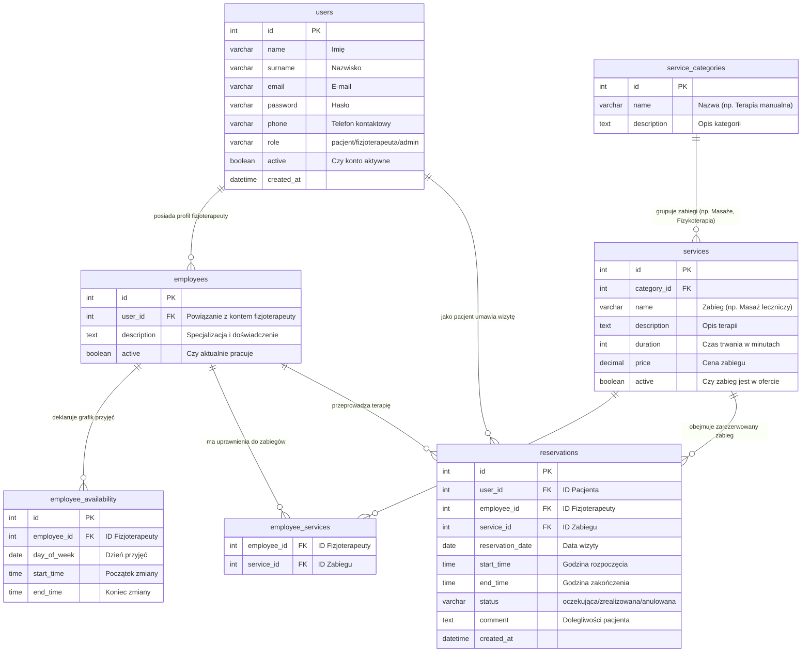

## Schemat Bazy Danych

```mermaid
erDiagram
    users ||--o{ employees : "posiada profil fizjoterapeuty"
    users ||--o{ reservations : "jako pacjent umawia wizytę"
    service_categories ||--o{ services : "grupuje zabiegi (np. Masaże, Fizykoterapia)"
    employees ||--o{ employee_availability : "deklaruje grafik przyjęć"
    employees ||--o{ employee_services : "ma uprawnienia do zabiegów"
    services ||--o{ employee_services : "jest wykonywany przez fizjoterapeutę"
    employees ||--o{ reservations : "przeprowadza terapię"
    services ||--o{ reservations : "obejmuje zarezerwowany zabieg"

    users {
        int id PK
        varchar name "Imię"
        varchar surname "Nazwisko"
        varchar email "E-mail"
        varchar password "Hasło"
        varchar phone "Telefon kontaktowy"
        varchar role "pacjent/fizjoterapeuta/admin"
        boolean active "Czy konto aktywne"
        datetime created_at
    }

    service_categories {
        int id PK
        varchar name "Nazwa (np. Terapia manualna)"
        text description "Opis kategorii"
    }

    services {
        int id PK
        int category_id FK
        varchar name "Zabieg (np. Masaż leczniczy)"
        text description "Opis terapii"
        int duration "Czas trwania w minutach"
        decimal price "Cena zabiegu"
        boolean active "Czy zabieg jest w ofercie"
    }

    employees {
        int id PK
        int user_id FK "Powiązanie z kontem fizjoterapeuty"
        text description "Specjalizacja i doświadczenie"
        boolean active "Czy aktualnie pracuje"
    }

    employee_services {
        int employee_id FK "ID Fizjoterapeuty"
        int service_id FK "ID Zabiegu"
    }

    employee_availability {
        int id PK
        int employee_id FK "ID Fizjoterapeuty"
        date day_of_week "Dzień przyjęć"
        time start_time "Początek zmiany"
        time end_time "Koniec zmiany"
    }

    reservations {
        int id PK
        int user_id FK "ID Pacjenta"
        int employee_id FK "ID Fizjoterapeuty"
        int service_id FK "ID Zabiegu"
        date reservation_date "Data wizyty"
        time start_time "Godzina rozpoczęcia"
        time end_time "Godzina zakończenia"
        varchar status "oczekująca/zrealizowana/anulowana"
        text comment "Dolegliwości pacjenta"
        datetime created_at
    }
```